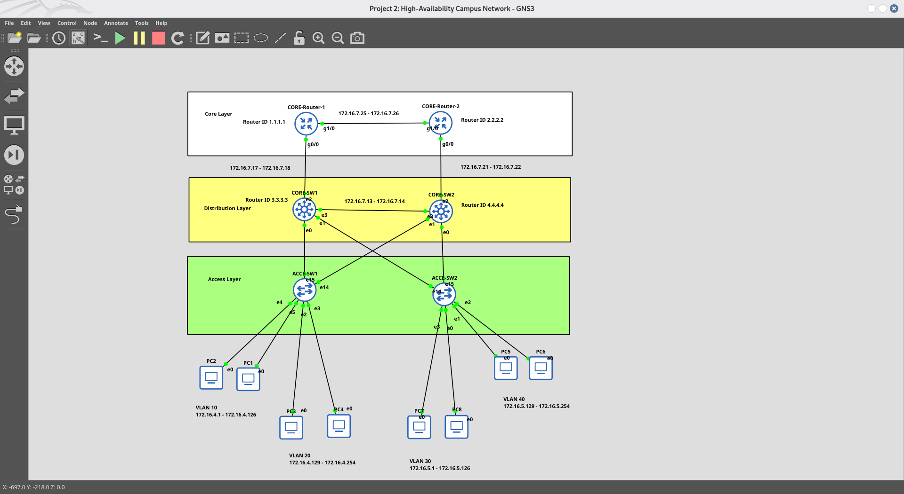
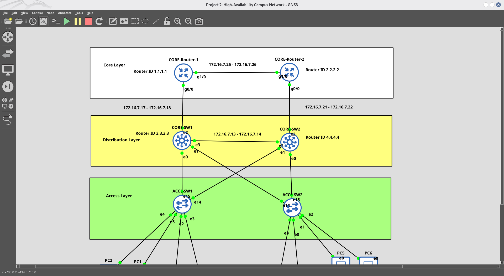
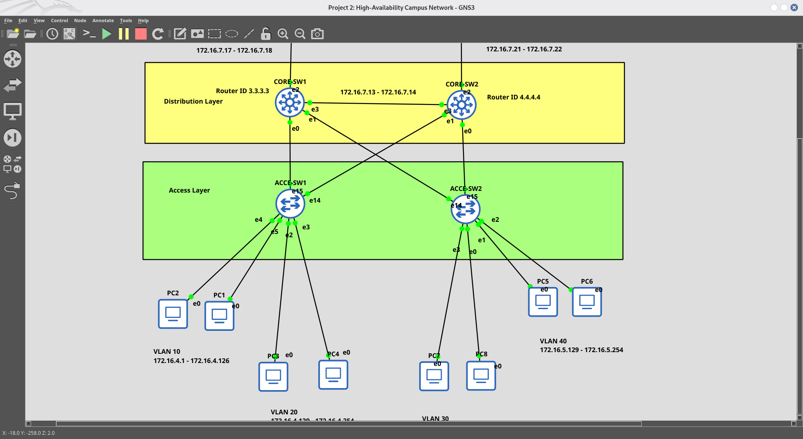

# 📁 Project 2: High-Availability Campus Network

## 📌 Project Overview
This project implements a **highly available campus network** using **HSRP** for gateway redundancy, **EtherChannel (LACP)** for link aggregation, and **RPVST+** for fast convergence. The design eliminates single points of failure and ensures seamless failover.

## 🎯 Objectives
- Provide **redundant default gateways** using HSRP.
- Increase **bandwidth and redundancy** using EtherChannel.
- Enable **fast convergence** using RPVST+, PortFast, and BPDU Guard.
- Implement **inter-VLAN routing** and **DHCP** for end devices.

---

## 🏗️ Network Topology

### Visual Network Design



**Figure 1:** Complete High-Availability Campus Network Design

---

### Topology Variations & Redundancy Views

#### Topology Version 2 - Redundancy Detail


**Figure 2:** Detailed redundancy configuration with link aggregation

---

#### Topology Version 3 - HSRP Failover Path


**Figure 3:** HSRP active/standby failover paths and EtherChannel aggregation

---

### Physical Connections
| Link | Source Device | Source Port | Destination Device | Destination Port |
|------|---------------|-------------|-------------------|------------------|
| **EtherChannel (LACP)** | CORE-SW1 | Gi0/0, Gi0/1 | CORE-SW2 | Gi0/0, Gi0/1 |
| **Trunk 1** | CORE-SW1 | Gi0/3 | ACC-SW1 | Gi3/2 |
| **Trunk 2** | CORE-SW2 | Gi0/3 | ACC-SW2 | Gi3/2 |

---

## 🔧 Technologies Used
- **HSRP (Hot Standby Router Protocol):** Gateway redundancy with Active/Standby failover.
- **EtherChannel (LACP):** Link aggregation for bandwidth and redundancy.
- **RPVST+ (Rapid Per-VLAN Spanning Tree):** Fast STP convergence.
- **PortFast + BPDU Guard:** Access port optimization and loop prevention.
- **Inter-VLAN Routing:** Routing between VLANs using SVIs.
- **DHCP (Dynamic Host Configuration Protocol):** Automatic IP assignment for end devices.

---

## 📊 IP Addressing Scheme

| VLAN | Network | Subnet Mask | Usable IPs | Virtual Gateway (HSRP) | CORE-SW1 (Physical) | CORE-SW2 (Physical) |
| :--- | :--- | :--- | :--- | :--- | :--- | :--- |
| **VLAN 10 (Mgmt)** | 172.16.4.0/25 | 255.255.255.128 | 126 | 172.16.4.1 | 172.16.4.2 | 172.16.4.3 |
| **VLAN 20 (HR)** | 172.16.4.128/25 | 255.255.255.128 | 126 | 172.16.4.129 | 172.16.4.130 | 172.16.4.131 |
| **VLAN 30 (Finance)** | 172.16.5.0/25 | 255.255.255.128 | 126 | 172.16.5.1 | 172.16.5.2 | 172.16.5.3 |
| **VLAN 40 (Engg)** | 172.16.5.128/25 | 255.255.255.128 | 126 | 172.16.5.129 | 172.16.5.130 | 172.16.5.131 |

### HSRP Priority Plan
| Switch | VLAN 10 | VLAN 20 | VLAN 30 | VLAN 40 |
|--------|---------|---------|---------|---------|
| **CORE-SW1** | Active (150) | Active (150) | Standby (100) | Standby (100) |
| **CORE-SW2** | Standby (100) | Standby (100) | Active (150) | Active (150) |

---

## ⚙️ Configuration Files

### 1. Access Switches (`ACCE-SW1` & `ACCE-SW2`)

```
interface gi3/2
 switchport trunk encapsulation dot1q
 switchport mode trunk
 switchport trunk native vlan 1
 switchport trunk allowed vlan 10,20,30,40
 no shutdown
 exit
end
write memory
```

### 2. Core Switch 1 (`CORE-SW1` — HSRP Active for VLAN 10,20)

```
default interface range gi0/0 - 1
default interface port-channel 1

! EtherChannel (LACP) to CORE-SW2
interface range gi0/0 - 1
 switchport trunk encapsulation dot1q
 switchport mode trunk
 switchport trunk native vlan 1
 switchport trunk allowed vlan 10,20,30,40
 channel-group 1 mode active
 no shutdown
 exit

interface port-channel 1
 switchport trunk encapsulation dot1q
 switchport mode trunk
 switchport trunk native vlan 1
 switchport trunk allowed vlan 10,20,30,40
 no shutdown
 exit

! Trunk to Access Switches
interface range gi0/3, gi1/0
 switchport trunk encapsulation dot1q
 switchport mode trunk
 switchport trunk native vlan 1
 switchport trunk allowed vlan 10,20,30,40
 no shutdown
 exit

! HSRP Configuration (Active for VLAN 10,20 | Standby for VLAN 30,40)
interface vlan 10
 ip address 172.16.4.2 255.255.255.128
 standby 10 ip 172.16.4.1
 standby 10 priority 150
 standby 10 preempt
 no shutdown
 exit

interface vlan 20
 ip address 172.16.4.130 255.255.255.128
 standby 20 ip 172.16.4.129
 standby 20 priority 150
 standby 20 preempt
 no shutdown
 exit

interface vlan 30
 ip address 172.16.5.2 255.255.255.128
 standby 30 ip 172.16.5.1
 standby 30 priority 100
 standby 30 preempt
 no shutdown
 exit

interface vlan 40
 ip address 172.16.5.130 255.255.255.128
 standby 40 ip 172.16.5.129
 standby 40 priority 100
 standby 40 preempt
 no shutdown
 exit

end
write memory
```

### 3. Core Switch 2 (`CORE-SW2` — HSRP Active for VLAN 30,40)

```
default interface range gi0/0 - 1
default interface port-channel 1

! EtherChannel (LACP) to CORE-SW1
interface range gi0/0 - 1
 switchport trunk encapsulation dot1q
 switchport mode trunk
 switchport trunk native vlan 1
 switchport trunk allowed vlan 10,20,30,40
 channel-group 1 mode active
 no shutdown
 exit

interface port-channel 1
 switchport trunk encapsulation dot1q
 switchport mode trunk
 switchport trunk native vlan 1
 switchport trunk allowed vlan 10,20,30,40
 no shutdown
 exit

! Trunk to Access Switches
interface range gi0/3, gi1/0
 switchport trunk encapsulation dot1q
 switchport mode trunk
 switchport trunk native vlan 1
 switchport trunk allowed vlan 10,20,30,40
 no shutdown
 exit

! HSRP Configuration (Standby for VLAN 10,20 | Active for VLAN 30,40)
interface vlan 10
 ip address 172.16.4.3 255.255.255.128
 standby 10 ip 172.16.4.1
 standby 10 priority 100
 standby 10 preempt
 no shutdown
 exit

interface vlan 20
 ip address 172.16.4.131 255.255.255.128
 standby 20 ip 172.16.4.129
 standby 20 priority 100
 standby 20 preempt
 no shutdown
 exit

interface vlan 30
 ip address 172.16.5.3 255.255.255.128
 standby 30 ip 172.16.5.1
 standby 30 priority 150
 standby 30 preempt
 no shutdown
 exit

interface vlan 40
 ip address 172.16.5.131 255.255.255.128
 standby 40 ip 172.16.5.129
 standby 40 priority 150
 standby 40 preempt
 no shutdown
 exit

end
write memory
```

---

## ✅ Verification Steps & Screenshots

### 1. Access Switches Verification (`ACC-SW1` & `ACC-SW2`)

| Command | Purpose | Screenshot |
|---------|---------|------------|
| `show vlan brief` | Verify VLAN database and port assignments |  |
| `show interface trunk` | Verify trunking status and allowed VLANs |  |
| `show ip interface brief` | Verify interface status and line protocol |  |
| `show spanning-tree brief` | Verify STP status and port states |  |
| `show cdp neighbors` | Verify CDP neighbors connected to Core Switches |  |

---

### 2. Core Switches Verification (`CORE-SW1` & `CORE-SW2`)

#### CORE-SW1 Screenshots:
| Command | Purpose | Screenshot |
|---------|---------|------------|
| `show standby brief` | Verify HSRP Active/Standby states and Virtual IPs |  |
| `show standby` | Verify detailed HSRP configuration, priorities, and timers |  |
| `show ip ospf neighbor` | Verify OSPF neighbor adjacency (should be FULL) |  |
| `show ip interface brief` | Verify IP addresses and status of all SVIs | .png) |
| `show interface trunk` | Verify trunking status on inter-core and downlink interfaces |  |
| `show spanning-tree root` | Verify STP root bridge information for all VLANs |  |
| `show cdp neighbors` | Verify CDP neighbors (Routers and Access Switches) | .png) |

#### CORE-SW2 Screenshots:
| Command | Purpose | Screenshot |
|---------|---------|------------|
| `show standby brief` | Verify HSRP Active/Standby states and Virtual IPs |  |
| `show standby` | Verify detailed HSRP configuration, priorities, and timers |  |
| `show ip ospf neighbor` | Verify OSPF neighbor adjacency (State should be FULL) | .png) |
| `show ip route ospf` | Verify dynamic routes learned via OSPF |  |
| `show ip interface brief` | Verify IP addresses and status of all SVIs | .png) |
| `show interface trunk` | Verify trunking status on inter-core and downlink interfaces |  |
| `show spanning-tree root` | Verify STP root bridge information for all VLANs |  |
| `show cdp neighbors` | Verify CDP neighbors (Routers and Access Switches) | .png) |

---

### 3. End Host PCs / Clients (VLAN 10, 20, 30, 40) - PC2 Verification

| Step | Purpose | Screenshot |
|------|---------|------------|
| **Step 1** | Request IP from DHCP server |  |
| **Step 2** | Verify assigned IP address, gateway and DHCP server |  |
| **Step 3** | Test local gateway connectivity (HSRP Virtual IP) | .png) |
| **Step 4** | Test Inter-VLAN routing (Ping PC in another VLAN) | .png) |
| **Step 6** | Trace packet path through active HSRP Core Switch |  |

---

## 🧪 Quick Verification Commands Summary

| Device | Command | Purpose |
|--------|---------|---------|
| **Access Switches** | `show vlan brief` | VLAN database |
| | `show interface trunk` | Trunk status |
| | `show cdp neighbors` | CDP neighbors |
| **Core Switches** | `show standby brief` | HSRP status |
| | `show ip ospf neighbor` | OSPF adjacency |
| | `show etherchannel summary` | EtherChannel status |
| | `show spanning-tree root` | STP root bridge |
| **PCs** | `ping <gateway>` | Connectivity test |

---

## 📚 Lessons Learned
- **HSRP** works seamlessly when both switches have consistent VLAN configurations.
- **EtherChannel** in GNS3 works more reliably with **mode active/passive** (LACP) than manual mode.
- **PortFast + BPDU Guard** is essential for access ports to avoid STP delays and prevent loops.
- **Native VLAN mismatch** can cause CDP errors and connectivity issues — always verify `show interface trunk`.
- **Preempt** ensures that the higher priority switch reclaims Active role after restoration.

---

## 🚀 Future Improvements
- Add **MLS QoS** for traffic prioritization.
- Implement **DHCP Snooping** for security.
- Extend to **IPv6** with HSRPv6.

---

## 🏆 LinkedIn Post

> **"🚀 Project 2: High-Availability Campus Network Completed!**
>
> **✅ HSRP configured for gateway redundancy (Active/Standby)**
> **✅ EtherChannel (LACP) for link aggregation**
> **✅ RPVST+ for fast convergence**
> **✅ PortFast + BPDU Guard for access ports**
> **✅ Sub-second failover achieved**
>
> **#Networking #HSRP #EtherChannel #CCNA #GNS3 #HighAvailability"**

---

## 📂 GitHub Repository Structure

```
High-Availability-Campus-Network/
├── README.md
├── Project highlight availibility .md
├── GNS File/
└── Screenshots/
    ├── ACC-SW1/
    │   ├── 1. Verify VLAN database and port assignments.png
    │   ├── 2. Verify trunking status and allowed VLANs on uplinks.png
    │   ├── 3. Verify interface status and line protocol.png
    │   ├── show cdp neighbors.png
    │   └── show spanning-tree brief
    ├── CORE-SW1/
    │   ├── 1. Verify HSRP summary.png
    │   ├── 2. Verify detailed HSRP configuration, priorities, and timers.png
    │   ├── 3. Verify OSPF neighbor adjacency status.png
    │   ├── 5. Verify IP addresses and status of all SVIs (VLAN interfaces).png
    │   ├── 6. Verify trunking status on inter-core and downlink interfaces.png
    │   ├── 7. Verify Spanning Tree root bridge information for all VLANs.png
    │   └── 8. Verify CDP neighbors (Routers and Access Switches).png
    ├── CORE-SW2/
    │   ├── 1. Verify HSRP summary .png
    │   ├── 2. Verify detailed HSRP configuration, priorities, and timers.png
    │   ├── 3. Verify OSPF neighbor adjacency status (State should be FULL).png
    │   ├── 4. Verify dynamic routes learned via OSPF.png
    │   ├── 5. Verify IP addresses and status of all SVIs (VLAN interfaces).png
    │   ├── 6. Verify trunking status on inter-core and downlink interfaces.png
    │   ├── 7. Verify Spanning Tree root bridge information for all VLANs.png
    │   └── 8. Verify CDP neighbors (Routers and Access Switches).png
    ├── PC2/
    │   ├── Step 1: Request IP address from DHCP Server.png
    │   ├── Step 2: Display assigned IP, subnet mask, default gateway, and DHCP server IP.png
    │   ├── Step 3: Test local gateway connectivity (HSRP Virtual IP).png
    │   ├── Step 4: Test Inter-VLAN routing (Ping PC located in another VLAN).png
    │   └── Step 6: Trace the packet path to verify routing through the active HSRP Core Switch.png
    └── Topology/
        ├── Network-Topology-Main.png
        ├── Network_topology2.png
        └── Network_Topology3.png

---
